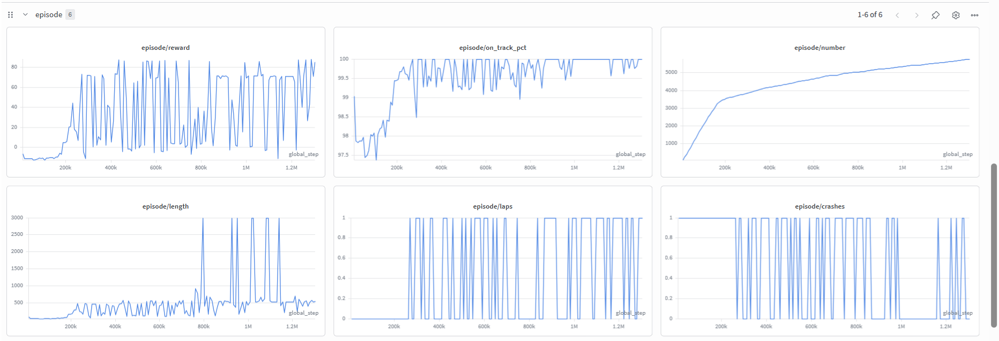
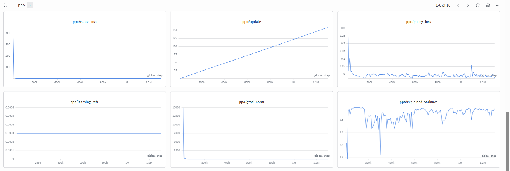

# Training & Curriculum

## Quick Start

```bash
# Install
uv sync

# Train (GPU recommended)
bash training/cmd
```

The `training/cmd` script runs:

```bash
uv run python -u training/train_torchrl.py \
  --num-envs 16 \
  --rollout-steps 8192 \
  --batch-size 1024 \
  --ppo-epochs 10 \
  --compile \
  --window 20 \
  --video-interval 100000 \
  --total-steps 300_000_000
```

Training uses **TorchRL PPO** with parallel environments (`ParallelEnv`),
periodic greedy evaluation, and automatic curriculum advancement.

After training starts, a W&B URL is printed. Use it to watch `episode/reward`,
`ppo/entropy`, and `curriculum/level` in real time.

---

## Scripts

| Script | Description |
|--------|-------------|
| `training/train_torchrl.py` | **Main** — TorchRL PPO with curriculum gating and priority replay |
| `training/monitor.py` | W&B auto-monitor — 50k-step health checks, run alongside training |
| `training/test_video.py` | Render inference episodes to MP4 from a checkpoint |
| `training/push_to_hub.py` | Upload trained model to HuggingFace Hub |

---

## Curriculum Progression

All 10 tracks are in the TRAIN split, ordered easy → hard. The agent trains
primarily on the current **frontier track** while replaying mastered tracks
to prevent catastrophic forgetting.

### Greedy Evaluation Gating

Every `--eval-interval-steps` (default 25k), the training script runs greedy
(deterministic) episodes on each TRAIN track:

1. If all tracks up to and including the frontier **pass** (≥1 lap, 0 crashes),
   the curriculum **advances** to the next track
2. If all 10 tracks pass simultaneously, **training is complete**
3. Tracks that **fail** are added to a **priority replay** array — workers
   dedicate extra episodes to these weak tracks until the next eval

### Anti-Forgetting Replay

```
70% of episodes → current frontier track
30% of episodes → round-robin through mastered tracks
```

Round-robin ensures every mastered track gets equal coverage, preventing early
tracks from being starved as the curriculum grows.

### Priority Replay

When greedy eval discovers a track the agent has regressed on, that track's
index is written to shared memory (`shared_priority`). Workers check this
array and give failing tracks 30% of their episodes, on top of normal replay.
Priority is cleared when the next eval shows all tracks passing.

---

## Key Hyperparameters

| Flag | Default | Description |
|------|---------|-------------|
| `--num-envs` | 4 | Parallel worker processes |
| `--total-steps` | 5,000,000 | Total environment steps |
| `--rollout-steps` | 2048 | Frames per PPO update (across all envs) |
| `--batch-size` | 64 | PPO minibatch size |
| `--ppo-epochs` | 10 | Update passes per rollout |
| `--lr` | 3e-4 | Adam learning rate (eps=1e-5) |
| `--gamma` | 0.99 | Discount factor |
| `--gae-lambda` | 0.95 | GAE smoothing |
| `--clip-eps` | 0.2 | PPO clipping range |
| `--vf-coef` | 0.5 | Value loss weight |
| `--ent-coef` | 0.01 | Entropy coefficient |
| `--max-grad-norm` | 0.5 | Gradient clipping norm |
| `--target-kl` | 0.1 | KL early-stop threshold per epoch |
| `--threshold` | 30.0 | Curriculum advancement threshold (× complexity) |
| `--window` | 20 | Rolling window for sampler statistics |
| `--replay-frac` | 0.3 | Anti-forgetting replay fraction |
| `--eval-interval-steps` | 25,000 | Steps between greedy eval over all TRAIN tracks |
| `--eval-episodes` | 1 | Greedy episodes per track during eval |
| `--video-interval` | 25,000 | Steps between inference video logs |
| `--checkpoint-interval` | 500,000 | Steps between checkpoint saves |
| `--keep-checkpoints` | 5 | Keep only last N checkpoints |
| `--resume` | — | Path to `.pt` checkpoint |
| `--compile` | off | Enable `torch.compile` |

---

## Checkpointing & Resume

Checkpoints are saved to `checkpoints/ppo_torchrl_step<N>_lvl<L>.pt` and contain:
model weights, optimizer state, curriculum state, sampler buffers, and W&B run ID.

```bash
# Resume from a specific checkpoint
uv run python -u training/train_torchrl.py \
  --resume checkpoints/ppo_torchrl_step00500000_lvl02.pt \
  --total-steps 10_000_000

# Auto-detect latest checkpoint (when --wandb-id is set)
uv run python -u training/train_torchrl.py \
  --wandb-id <run-id> --total-steps 10_000_000
```

Charts continue on the same W&B run. You can change `--num-envs` or
`--compile` on resume without affecting the model.

---

## Inference Videos

```bash
uv run python training/test_video.py --track 1
uv run python training/test_video.py \
  --checkpoint checkpoints/ppo_torchrl_final.pt --track 5
```

During training, videos are logged every `--video-interval` steps for the
current frontier track. Check `inference_videos/` for MP4 files.

---

## W&B Metrics

### Episode Metrics



### PPO Metrics



| Key | Description |
|-----|-------------|
| `episode/reward` | Total reward per episode |
| `episode/laps` | Laps completed |
| `episode/crashes` | Off-track exits |
| `curriculum/level` | Current frontier index (0-based) |
| `curriculum/greedy_pass` | 1 if all tracks passed greedy eval |
| `curriculum/greedy_n_pass` | Number of tracks passing |
| `curriculum/priority_n_tracks` | Tracks in priority replay |
| `ppo/policy_loss` | Policy gradient loss |
| `ppo/value_loss` | Value function loss |
| `ppo/entropy` | Policy entropy |
| `ppo/approx_kl` | Approximate KL divergence |
| `ppo/explained_variance` | Value quality (1.0 = perfect) |
| `ppo/grad_norm` | Gradient norm after clipping |
| `system/steps_per_sec` | Training throughput |

---

## Monitoring

Run alongside training in a separate terminal:

```bash
uv run python training/monitor.py
```

Polls W&B every 60 seconds, prints live metrics, and fires PASS/FAIL reports
at every 50k step boundary. If FAIL, it prints the exact resume command with fixes.
